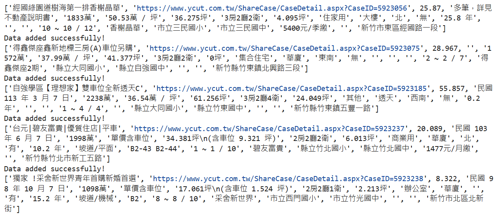
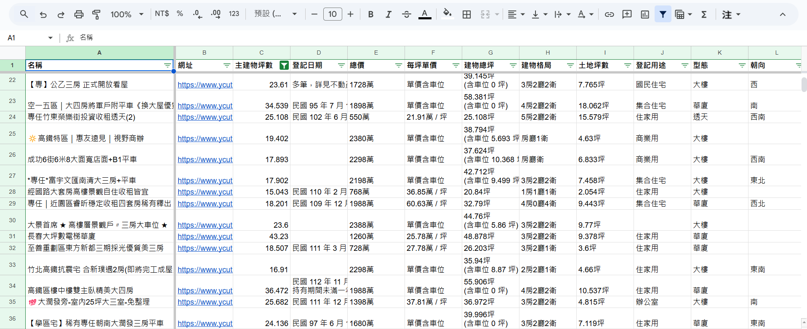
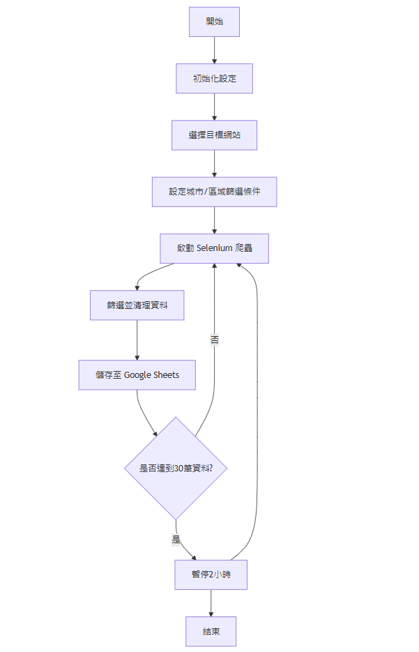

# House Hunter Crawler 🏠🕵️

## 專案描述
一個房屋資訊爬蟲系統，可以自動從網路上蒐集房屋出售資訊，並將篩選後的資料整合到 Google Sheets。  
Google sheet: https://docs.google.com/spreadsheets/d/1mhNnsbtlpaU_UYieQ4JJoS7ryBUhRh28ioyTo3cCDQU/edit?usp=sharing  

## 主要功能
- 使用 Selenium 進行網頁爬蟲
- 城市與區域精準篩選
- 智能暫停機制，避免被網站偵測
- 結合 Google API 自動儲存資料

## 技術棧
- Python
- Selenium
- Google Sheets API
- BeautifulSoup

## 爬蟲策略
- 每爬取 30 個房源暫停 2 小時
- 篩選新竹 去除偏遠地區
- 防反爬蟲機制

## 輸出
- 螢幕輸出資訊
    
- google sheet 資訊
    

## 流程圖

